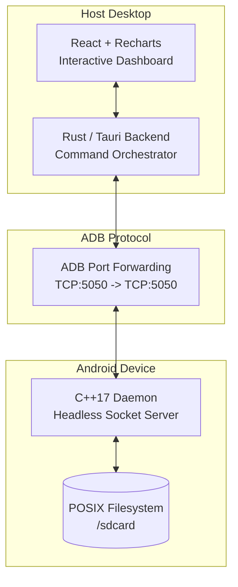
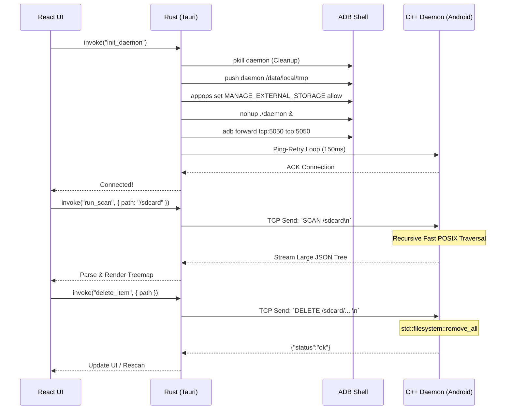

<div align="center">
  
  <h1>SocketSweep</h1>
  <p><strong>See what's eating your Android storage in seconds, not minutes.</strong></p>
  
  
  
  
  
  
  <br />
  <a href="https://github.com/sponsors/VishnuSrivatsava"></a>
</div>

<br />

<div align="center">
  <a href="https://youtu.be/ttsc6Xf6Xb4">
    
  </a>
  <br />
  <a href="https://youtu.be/ttsc6Xf6Xb4"><strong>▶ Watch the full demo and architecture breakdown</strong></a>
</div>

---

## 😤 The Problem

Ever plugged your Android phone into your PC to figure out what's eating all your storage?

Here's what happens with the standard USB connection (MTP):

- You open the phone in File Explorer / Finder
- Click on a folder with lots of files
- **"Calculating size..."** — hangs for 4+ minutes
- Eventually shows sizes, but navigating is painfully slow
- Trying to find large files? Good luck scrolling through hundreds of folders one by one

This is because **MTP (Media Transfer Protocol)** — the protocol your OS uses to talk to Android over USB — was designed in 2008 for MP3 players. It transfers file metadata one item at a time, with no caching, no parallel requests, and no way to do a fast recursive scan. It was never built for phones with 100GB+ of photos, videos, and apps.

**SocketSweep bypasses MTP entirely.**

---

## ⚡ How Fast?

Full `/sdcard` scan on a **Samsung Galaxy S24 Ultra (256GB)** with ~47,000 files:

> **SocketSweep: ~6.9 seconds** — full interactive treemap ready to explore.

For comparison, doing the same thing over MTP (plugging in the phone and browsing via Windows Explorer or Finder) typically involves minutes of "Calculating size..." freezes, and macOS Finder doesn't even show folder sizes at all.

*Proper side-by-side benchmarks against OpenMTP and other tools are coming soon.*

---

## 📸 What It Looks Like

<div align="center">
  
  
  <br />
  <p><em>Left: Connection Dashboard | Right: Interactive Treemap — click any block to drill down</em></p>
</div>

---

## 🚀 How to Use

### 1. Download
**[Download SocketSweep v1.0.0](https://github.com/VishnuSrivatsava/SocketSweep/releases/tag/v1.0.0)**

| Platform | Download |
|----------|----------|
| 🪟 **Windows** | [Installer (.exe)](https://github.com/VishnuSrivatsava/SocketSweep/releases/tag/v1.0.0) · [Enterprise (.msi)](https://github.com/VishnuSrivatsava/SocketSweep/releases/tag/v1.0.0) |
| 🍎 **macOS** (Apple Silicon) | [Disk Image (.dmg)](https://github.com/VishnuSrivatsava/SocketSweep/releases/tag/v1.0.0) |
| 🐧 **Linux** | [AppImage](https://github.com/VishnuSrivatsava/SocketSweep/releases/tag/v1.0.0) · [.deb](https://github.com/VishnuSrivatsava/SocketSweep/releases/tag/v1.0.0) |

> **macOS note:** Since the build is ad-hoc signed, run this once after installing:
> ```bash
> xattr -cr /Applications/SocketSweep.app
> ```

### 2. Enable USB Debugging on your phone
Go to **Settings → About Phone → tap "Build Number" 7 times** to unlock Developer Options. Then go to **Settings → Developer Options → enable "USB Debugging"**.

### 3. Plug in and scan
1. Connect your phone via USB cable
2. Open SocketSweep
3. Click **Connect** — the app will automatically push the daemon to your phone and set everything up
4. Click **Scan** — your full storage treemap loads in seconds
5. Click on any block in the treemap to drill down. Found something huge you don't need? Delete it right from the app.

That's it. No apps to install on your phone, no Wi-Fi setup, no root required.

---

## 🧠 How It Works (The Short Version)

Instead of going through MTP, SocketSweep does something completely different:

1. **Pushes a tiny C++ program** (~1MB) to your phone via ADB
2. **That program scans the filesystem directly** on the phone using native POSIX calls — this is why it's so fast (no MTP bottleneck)
3. **Streams the results back** to your PC over a TCP socket through the USB cable
4. **Renders an interactive treemap** in a React frontend so you can visually see what's taking space

The architecture was inspired by [scrcpy](https://github.com/Genymobile/scrcpy) — the "push a native binary via ADB, communicate over a local socket" pattern.

---

## 🏗 Architecture (For Developers)

SocketSweep has three layers:



### Interaction Lifecycle



---

## 🔧 Development Setup (Building from Source)

### Prerequisites
1. **Node.js** (v18+)
2. **Rust** (v1.70+ with Cargo)
3. **Android NDK** (v26d or newer)
4. **Android SDK / ADB** installed and added to your system `$PATH`.

### 1. Compile the C++ Daemon
Cross-compile the daemon for `aarch64-linux-android`:
```bash
# Set your NDK path
export NDK=/path/to/your/android-ndk-r26d

# Build the daemon
cd engine
bash ./build.sh
```
*This generates the stripped `daemon` binary in the `engine/` directory.*

### 2. Install Frontend Dependencies
```bash
cd ..
npm install
```

### 3. Run the App
```bash
npm run tauri dev
```
*Ensure your Android device is plugged in via USB and **USB Debugging** is enabled.*

---

## 🛠 Troubleshooting

### "0 Files" or Missing Folders on Android 11+
Android 11 introduced Scoped Storage, restricting file access. SocketSweep automatically tries to bypass this via:
```bash
adb shell appops set com.android.shell MANAGE_EXTERNAL_STORAGE allow
```
If scanning still shows nothing, check if your OEM requires extra toggles (e.g., Xiaomi needs "USB Debugging (Security settings)" enabled).

### Daemon Fails to Start
If you get `Permission denied`, make sure the daemon is being pushed to `/data/local/tmp/`. Modern Android blocks execution from `/sdcard/`. SocketSweep handles this automatically.

---

## 💖 Support This Project

If SocketSweep saved you from the nightmare of MTP, consider supporting its development:

<div align="center">
  <a href="https://github.com/sponsors/VishnuSrivatsava"></a>
  &nbsp;&nbsp;
  <a href="https://paypal.me/mathcuber"></a>
</div>

---

## 📄 License

SocketSweep is released under the **GNU General Public License v3.0**. See the [LICENSE](LICENSE) file for more details.

---

## 👋 Author

Built by **Vishnu Srivatsava**. Inspired by the architecture of [scrcpy](https://github.com/Genymobile/scrcpy). Currently looking for Backend / Systems Engineering roles. Feel free to reach out on [LinkedIn](https://www.linkedin.com/in/vishnu-srivatsava-642222238/) or via [email](mailto:vishnusrivatsava@gmail.com).
