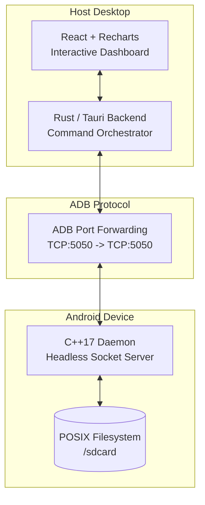
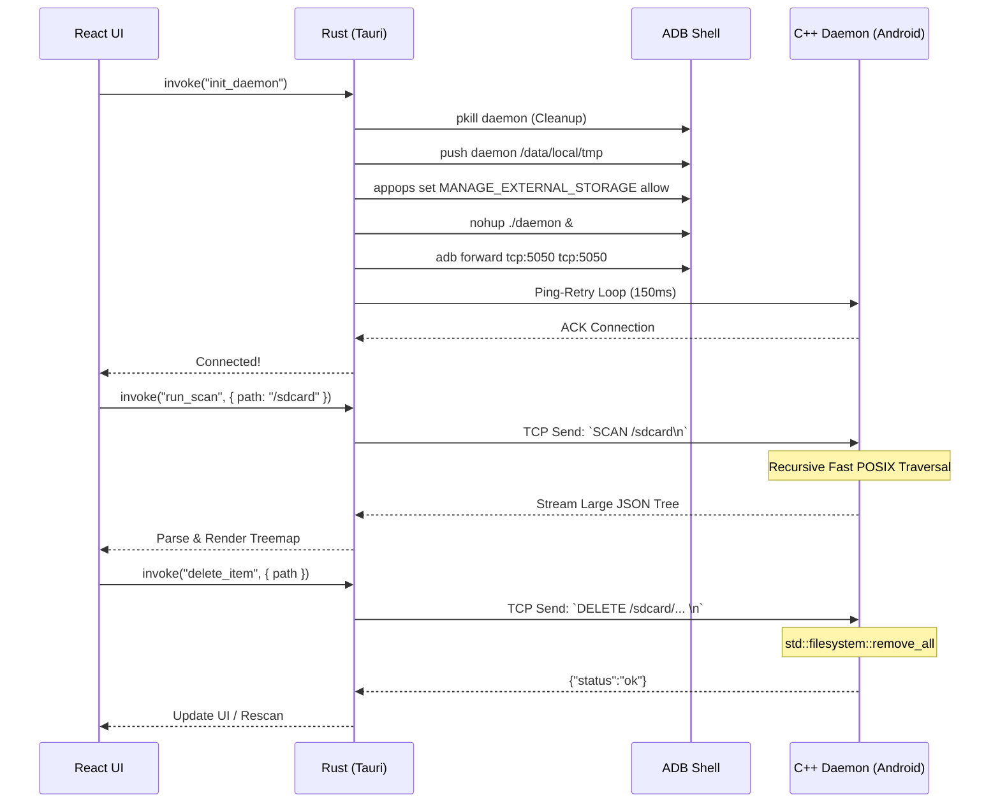

<div align="center">
  
  <h1>SocketSweep</h1>
  <p><strong>A high-performance Android storage analyzer built to completely bypass the agonizingly slow USB MTP.</strong></p>
  
  
  
  
  
  
</div>

<br />

By pushing a custom C++ daemon directly to your Android device via ADB and communicating over a local TCP tunnel, SocketSweep achieves near-instantaneous filesystem traversals and deletions. If you have ever waited minutes just to see the contents of your Android's `/sdcard` directory over a USB cable, SocketSweep is the ultimate, blazing-fast alternative.

---

## 📸 Screenshots

<div align="center">
  
  
  <br />
  <p><em>Left: The Connection Dashboard | Right: The Interactive Treemap Visualization</em></p>
</div>

---

## 📥 Downloads

**[Download SocketSweep v1.0.0 for macOS](https://github.com/VishnuSrivatsava/SocketSweep/releases/tag/v1.0.0)**

- [📱 MacOS (.dmg)](https://github.com/VishnuSrivatsava/SocketSweep/releases/tag/v1.0.0)
- [🪟 Windows (.exe)]() *(Coming Soon)*
- [🐧 Linux (.AppImage)]() *(Coming Soon)*

---

## 🏗 System Architecture

SocketSweep operates across a three-layer stack: **The Glass** (Frontend), **The Bridge** (Rust Backend), and **The Engine** (C++ Android Daemon).



## 🔄 Interaction Lifecycle



---

## 🚀 Development Setup & Build

### Prerequisites
1. **Node.js** (v18+)
2. **Rust** (v1.70+ with Cargo)
3. **Android NDK** (v26d or newer)
4. **Android SDK / ADB** installed and added to your system `$PATH`.

### 1. Compile the C++ Engine (Android Daemon)
You must cross-compile the C++ daemon for `aarch64-linux-android` before running the app.
```bash
# Set your NDK path
export NDK=/path/to/your/android-ndk-r26d

# Build the daemon
cd engine
bash ./build.sh
```
*This will generate the stripped `daemon` binary in the `engine/` directory.*

### 2. Install Frontend Dependencies
```bash
# Return to project root
cd ..
npm install
```

### 3. Run the App
```bash
npm run tauri dev
```
*Ensure your Android device is plugged in via USB and **USB Debugging** is enabled.*

---

## 🛠 Troubleshooting

### "0 Files" or Missing Folders on Android 11+
Android 11 introduced Scoped Storage, heavily restricting file access. SocketSweep automatically attempts to grant itself bypass permissions via ADB:
```bash
adb shell appops set com.android.shell MANAGE_EXTERNAL_STORAGE allow
```
If your device still refuses to scan `/sdcard`, ensure that you haven't blocked ADB from managing permissions in your developer options (some OEMs like Xiaomi require "USB Debugging (Security settings)" to be toggled on).

### Daemon Fails to Start
If the daemon is killed immediately or throws `Permission denied`, ensure it is being executed from `/data/local/tmp/`. Modern Android versions prevent executing binaries stored directly on the `/sdcard/`. SocketSweep handles this automatically by pushing to `/data/local/tmp/socketsweep_daemon`.

---

## 📄 License

SocketSweep is released under the **GNU General Public License v3.0**. See the [LICENSE](LICENSE) file for more details.

---

## 👋 Author

Built by **Vishnu Srivatsava**. Currently looking for Backend / Systems Engineering roles. Feel free to reach out on [LinkedIn](https://www.linkedin.com/in/vishnu-srivatsava-642222238/) or via [email](mailto:vishnusrivatsava@gmail.com).
